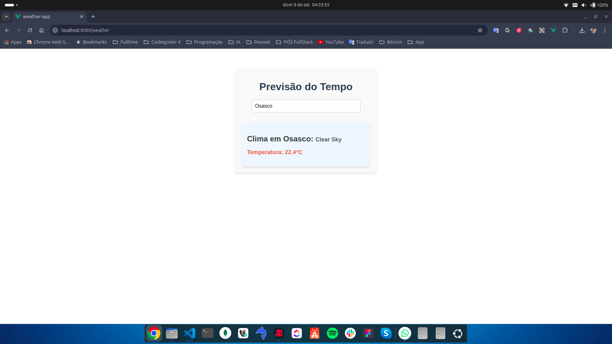

# Weather App - Projeto FullStack Pós-Graduação Unimar

Este é um projeto desenvolvido como parte do curso de pós-graduação FullStack na **Universidade de Marília (Unimar)**. O objetivo do projeto é criar uma aplicação web de previsão do tempo utilizando tecnologias modernas de frontend, como **Vue.js**, juntamente com **axios**, **Pinia** para gerenciamento de estado, e **Vue Router** para navegação. A aplicação consome dados de uma API gratuita de clima para exibir a previsão do tempo de qualquer cidade.

## Tecnologias Utilizadas

- **Vue.js**: Framework progressivo para construção de interfaces de usuário.
- **Axios**: Biblioteca para realizar requisições HTTP.
- **Pinia**: Biblioteca para gerenciamento de estado (store).
- **Vue Router**: Biblioteca para gerenciar rotas dentro da aplicação.
- **API de Clima**: Consumo de uma API externa gratuita para previsão do tempo (OpenWeatherMap).

## Funcionalidades

- Busca de clima atual para uma cidade específica.
- Exibição de dados meteorológicos, como temperatura e condições climáticas.
- Navegação entre diferentes páginas utilizando Vue Router.
- Gerenciamento de estado com Pinia para armazenar e manipular dados de forma eficiente.

## Como Executar o Projeto

### Pré-requisitos

Antes de começar, certifique-se de ter o **Node.js** e o **npm** instalados em sua máquina. 

### Passos para Rodar o Projeto

1. Clone o repositório:
   ```bash
   git clone https://github.com/fsouzaweb/unimar-weather-vue.git
   ```

2. Acesse o diretório do projeto:
   ```bash
   cd unimar-weather-vue
   ```

3. Instale as dependências:
   ```bash
   npm install
   ```

4. Execute o servidor de desenvolvimento:
   ```bash
   npm run serve
   ```

5. Abra o navegador e acesse:
   ```
   http://localhost:8080
   ```

## API de Clima

Este projeto utiliza a API [OpenWeatherMap](https://openweathermap.org/) para buscar dados meteorológicos. Certifique-se de obter uma chave de API gratuita no site da OpenWeatherMap e substituí-la no código antes de executar a aplicação.

### Utilizando Variáveis de Ambiente

Para garantir a segurança e flexibilidade na gestão de sua chave de API, recomendamos o uso de variáveis de ambiente. Siga os passos abaixo:

1. Crie um arquivo `.env` na raiz do seu projeto e adicione a seguinte linha com sua chave de API:
   ```bash
   VUE_APP_API_KEY=SUA_CHAVE_API_AQUI
   ```

2. No código, use a variável de ambiente assim:
   ```javascript
   const apiKey = process.env.VUE_APP_API_KEY;
   ```

3. Reinicie o servidor de desenvolvimento para garantir que as variáveis de ambiente sejam carregadas:
   ```bash
   npm run serve

## Captura de Tela

Aqui está um exemplo da interface da aplicação:




## Autor

Desenvolvido por [Fabiano Souza](https://github.com/fsouzaweb) como parte do curso de Pós-Graduação FullStack na **Unimar**.

## GitHub

- [Meu GitHub](https://github.com/fsouzaweb)
